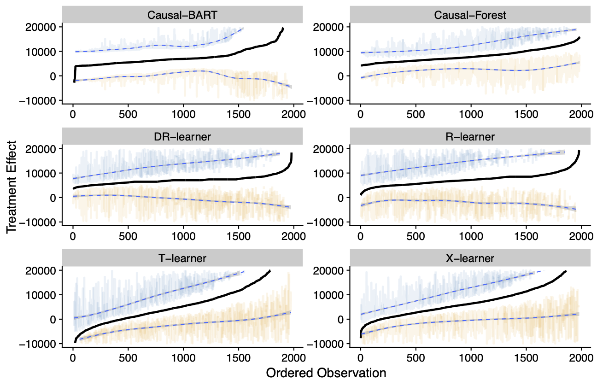

[](http://quantlet.de/)

## [](http://quantlet.de/) **401k-Example** [](http://quantlet.de/)

```yaml

Name of Quantlet: 401k-Example

Published in: 'CATE meets MLE - A tutorial'

Description: Files to estimate the CATE from the empirical dataset (401(k) eligibility). Uses all meta-learners as well as causal BART and causal forest. 

The data structure has to be the following: 

- y = outcome variable
- d = treatment variable
- covariates = the covariates to map on d or y. The names of the covariates can be seen in the main.R file. 


Keywords: 'CATE, ML, 401(k), causal-inference, treatment'

Author: 'Daniel Jacob'

See also: ''

Submitted:  '10.02.2021'

```

