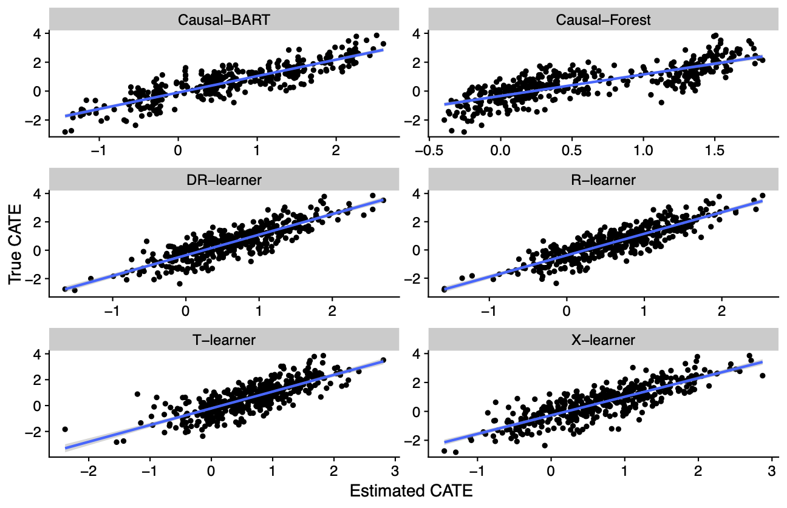

[](http://quantlet.de/)

## [](http://quantlet.de/) **Simulation_Example** [](http://quantlet.de/)

```yaml

Name of Quantlet: Simulation_Example

Published in: 'CATE meets MLE - A tutorial'

Description: Simulation of datasets for the estimation of the CATE. Different settings are possible, e.g random assignment, confounding (selection-bias), linear and non-linear dependencies.

The data structure has to be the following: 

- y = outcome variable
- d = treatment variable
- covariates = the covariates to map on d or y
- theta =  the true treatment effect (simulation study also includes)


Keywords: 'CATE, ML, simulation, causal-inference, treatment'

Author: 'Daniel Jacob'

See also: 'https://arxiv.org/abs/2007.02852'

Submitted:  '10.02.2021'

```


